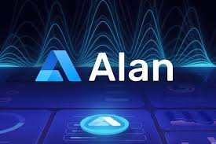
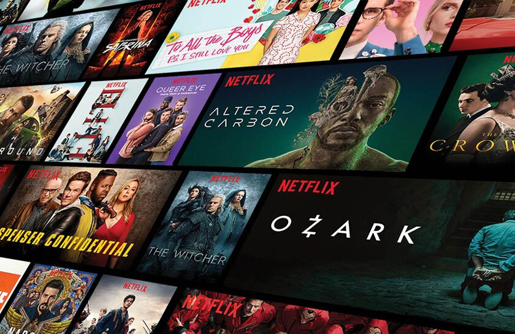

I always try to find time to work and learn something new. Usually, most of these _pet-projects_ don't see the light of day. They are, however, great opportunities to try something in the real world and learn from it.

<table>
    <thead>
        <tr>
            <th>Logo</th>
            <th>Title</th>
            <th>Description</th>
            <th>Link</th>
        </tr>
    </thead>
    <tbody>
         <tr>
            <td></td>
            <td>Wigma</td>
            <td>A cloud-based design tool that enables collaborative interface design and prototyping, allowing teams to work together in real-time on creating user interfaces for web applications.</td>
            <td><a target="_blank" href="https://blowfish.page">site</a> <a target="_blank" href="https://github.com/nunocoracao/blowfish">github</a></td>
        </tr>
         <tr>
            <td></td>
            <td>Loom</td>
            <td>A comprehensive video conferencing platform that facilitates online meetings, webinars and live chats, offering features like screen sharing, file sharing, and text chat, accessible via desktop or mobile apps</td>
            <td><a target="_blank" href="https://loom-video-conference.vercel.app/">site</a> <a target="_blank" href="https://github.com/ashish-nath/loom-video-conference">github</a></td>
        </tr>
        <tr>
            <td></td>
            <td>Alan Ai</td>
            <td>An intelligent voice assistant news-aricles Web-app made with the help of Alan Ai platform. This app provides articles on any news channel, topics, terms etc. Anything ask him he will provide the details on that subject. Alan is program in such a way that is has friendly appearance which having conversation.</td>
            <td><a target="_blank" href="https://alan-ai-interactive-app.netlify.app/">site</a> <a target="_blank" href="https://github.com/ashish-nath/alan_ai">github</a></td>
        </tr>
         <tr>
            <td></td>
            <td>Nimiflix</td>
            <td>Develop a movie and TV show trailer watcher application utilizing the TMDB API.</td>
            <td><a target="_blank" href="https://vexflix.vercel.app/">site</a> <a target="_blank" href="https://github.com/ashish-nath/Nimiflix">github</a></td>
        </tr>
    </tbody>
</table>